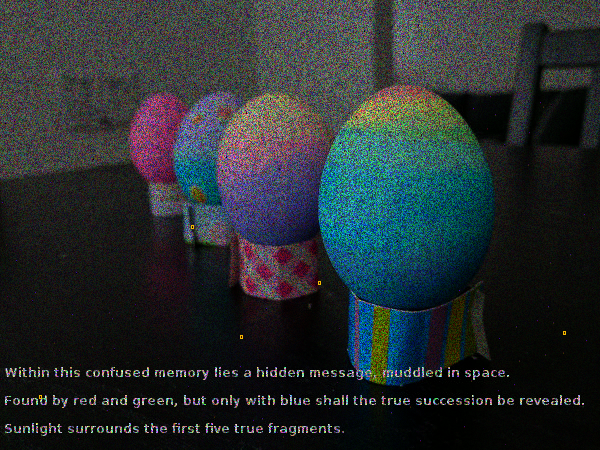

# Puzzle 1



## Generation
Output:
```
CONGRATULATIONS AGENT BURL. YOU HAVE PASSED PUZZLE 1.
-.-. --- -. --. .-. .- - ..- .-.. .- - .. --- -. ...  .- --. . -. -  -... ..- .-. .-.. .-.-.-  -.-- --- ..-  .... .- ...- .  .--. .- ... ... . -..  .--. ..- --.. --.. .-.. .  .---- .-.-.-
There are 187 fragments
(187, 3)
[[50 50  0]
 [50 50  0]
 [50 50  0]
 [ 0  0  0]
 [50  0  0]
 [50 50  0]
 [50  0  0]
 [50 50  0]
 [50  0  0]
 [50 50  0]]
Indexed pixels 187 vs 187
Message is safe
[Finished in 0.3s]
```

## Solution
Output:
```
[[50 50  0]
 [50  0  0]
 [50  0  0]
 [ 0  0  0]
 [50  0  0]]
-.-. --- -. --. .-. .- - ..- .-.. .- - .. --- -. ...  .- --. . -. -  -... ..- .-. .-.. .-.-.-  -.-- --- ..-  .... .- ...- .  .--. .- ... ... . -..  .--. ..- --.. --.. .-.. .  .---- .-.-.-
CONGRATULATIONS AGENT BURL. YOU HAVE PASSED PUZZLE 1.
[Finished in 1.2s]
```
